# Goblin!

> A deterministic intraday trading bot that lives in a cave, watches markets all day, and refuses to confuse activity with opportunity.

**Goblin!** is an experimental, auditable trading engine written in Python. It consumes broker market data, builds candles, detects trend-following setups, evaluates whether a trade is economically and structurally viable, and only then allows the candidate to reach execution.

The execution loop is intentionally deterministic. No language model or opaque AI component decides when to buy or sell. AI may be used later as an offline assistant for log analysis, replay, and strategy research, but the live decision path remains testable and reproducible.

> [!WARNING]
> This project is research software, not financial advice. Start with `paper` or `etoro_demo`. Real-money trading can lose capital, and the current strategy is still being validated through long-running demo sessions and post-run simulations.

## Why “Goblin!”?

Because this is not a majestic oracle predicting the future. It is a small, stubborn worker sitting in a cave, checking spreads, cooldowns, fees, momentum, market structure, and whether a target is actually reachable before touching an order.

The display name is **Goblin!**. Technical identifiers use `goblin` because package names, service names, paths, and container names do not accept punctuation consistently.

## Core principles

- **Deterministic execution** — the same market state and configuration should produce the same decision.
- **Demo first** — real-money execution exists, but the safe operating modes are `paper` and `etoro_demo`.
- **Signal quality is not risk management** — strategies and scoring decide whether a setup is good; the risk layer decides whether the account can safely take it.
- **Fees are part of the trade** — expected profitability is calculated after configured open fees, close fees, fixed fees, and spread.
- **No late-entry denial by score alone** — a strong raw signal cannot hide exhausted movement or an unrealistic take-profit target.
- **Every decision must be explainable** — structured journals, summaries, manifests, and reason codes are first-class features.
- **Broker code stays isolated** — market and order peculiarities live behind the broker abstraction.
- **The bot may do nothing** — zero trades is a valid and often successful result.

## Current capabilities

Goblin currently includes:

- broker abstraction with a local fake broker and eToro demo/live clients;
- cached instrument and position resolution for eToro;
- multi-symbol watchlists across crypto, US equities, and European equities;
- configurable trading sessions with timezone support;
- market snapshot collection and in-process candle construction;
- deterministic long/short `TrendStrategy`;
- market-regime filtering for dead, ranging, noisy, and trending conditions;
- breakout/breakdown validation with candle quality and snapshot momentum;
- separate BUY and SELL scoring pipelines;
- move-exhaustion and late-entry analysis;
- TP-before-SL probability estimation for diagnostics;
- spread-aware and fee-aware candidate economics;
- TP feasibility analysis based on ATR, momentum, costs, consumed movement, and distance to recent extremes;
- explicit candidate readiness: `TRADABLE_NOW`, `WAIT_CONFIRMATION`, or `REJECT`;
- pending entries with retest/continuation and persistence confirmation;
- fixed cooldowns, bilateral symbol locks after stop loss, and post-TP reset guards;
- structural stop-loss calculation and constant-risk position sizing;
- per-asset SL/TP profiles, including dynamic US levels and an EU micro-scalp fallback;
- centralized account risk and session quotas;
- market-order execution and broker-fill reconciliation;
- persistent open positions and cooldown memory in SQLite;
- stop loss, take profit, breakeven, trailing stop, stale-position exit, and session force-close logic;
- structured journals, partial/final summaries, run manifests, and runtime heartbeats;
- a broad pytest suite and GitHub Actions validation.

## High-level architecture

```mermaid
flowchart LR
    A[Broker market data] --> B[Session filter]
    B --> C[Snapshots]
    C --> D[CandleBuilder]
    C --> E[Snapshot momentum]
    D --> F[TrendStrategy]
    E --> F
    F --> G[TradeCandidate scoring]
    G --> H[Cooldown and re-entry guards]
    H --> I[Economics + SL/TP]
    I --> J[TP feasibility + readiness]
    J -->|TRADABLE_NOW| K[CandidateSelector]
    J -->|WAIT_CONFIRMATION| L[PendingEntryManager]
    L --> M[Retest / persistence confirmation]
    M --> I
    J -->|REJECT| N[Structured journal]
    K --> O[RiskManager]
    O --> P[TradeExecutor]
    P --> Q[Broker order]
    Q --> R[PositionTracker]
    R --> S[SL / TP / managed stops / stale exit]
    S --> N
```



## Runtime flow in detail

### 1. Session filtering

Each symbol belongs to exactly one asset class:

- `CRYPTO`
- `EQUITY_US`
- `EQUITY_EU`

The trading-session service decides whether Goblin should collect snapshots, allow new entries, or force-close positions. Empty session configuration means 24/7. For finite sessions:

- new entries stop during the final 60 minutes;
- force-close handling begins during the final 20 minutes.

### 2. Market data and candles

The broker returns bid, ask, last price, and timestamp snapshots. A `CandleBuilder` aggregates those snapshots into the configured timeframe. Strategies receive both:

- closed candles for structure and trend;
- recent snapshots for short-term momentum confirmation.

### 3. Trend detection

`TrendStrategy` first classifies the market regime. It stays flat when the market is dead, ranging, too noisy, or contradictory.

For a long setup, Goblin expects:

- a positive session move;
- fast moving average above the slow moving average;
- a confirmed breakout;
- a sufficiently large and well-closed candle;
- bullish snapshot momentum.

The short path mirrors those rules for bearish breakdowns.

When candle data is temporarily unreliable, the strategy can use a snapshot-momentum fallback instead of silently fabricating candle confidence.

### 4. Candidate scoring

A valid signal becomes a `TradeCandidate`. BUY and SELL candidates are scored independently so that short-specific weaknesses cannot be hidden inside a generic score.

The scoring layer considers, among other things:

- setup quality;
- trend and breakout/breakdown strength;
- candle close quality;
- snapshot momentum;
- movement already consumed;
- distance to the recent extreme;
- long/short-specific penalties;
- late-entry severity.

A high raw score does not guarantee execution.

### 5. Cooldown and re-entry guards

Before ranking, Goblin checks persistent closed-trade memory:

- fixed cooldown after TP, SL, manual close, or unknown close;
- bilateral symbol lock after stop loss;
- same-direction post-TP rejection until the market has reset through a meaningful pullback or new structure.

These checks happen before `top_n`, so stale or blocked candidates cannot occupy selection slots.

### 6. Economics and effective SL/TP

The economics estimator resolves:

- position value;
- effective stop-loss and take-profit percentages;
- structural invalidation when available;
- constant-risk resizing when the structural stop is wider or narrower than the baseline;
- estimated open/close fees;
- spread cost;
- expected gross and net profit;
- loss at stop after costs.

The absolute structural stop is preserved after the real broker fill, even when slippage changes the executed entry price.

### 7. TP feasibility and readiness

The TP feasibility analyzer asks a different question from the strategy:

> Even if the direction is correct, is the configured target realistically reachable before the stop, and is the remaining move worth the cost?

It evaluates target distance relative to ATR and momentum, cost-to-target ratio, consumed session movement, and proximity to recent extremes.

The result is one of:

- `TRADABLE_NOW` — the candidate may reach selection immediately;
- `WAIT_CONFIRMATION` — the setup is plausible but needs market confirmation;
- `REJECT` — a hard feasibility condition failed.

### 8. Pending confirmation

A waiting candidate is stored by `PendingEntryManager` for a limited number of candles. It may be confirmed by:

- a retest followed by continuation; or
- persistent closes beyond the breakout/breakdown level.

After confirmation, the candidate is fully rebuilt and re-evaluated. A confirmed candidate is not sent back into the same `WAIT_CONFIRMATION` loop: it may reach the selector, while keeping its feasibility penalty and adjusted score. Hard rejections still block it.

Pending entries can expire, be invalidated, or be retried after downstream selection rejection without losing their age.

### 9. Selection

`CandidateSelector` applies:

- asset-aware minimum scores;
- hard rejection reasons;
- expected net profitability after fees;
- ranking by score bucket, expected net profit, and score;
- the profile `top_n` limit.

Readiness answers “can this setup be considered now?” Selection answers “is it good enough compared with the other candidates?”

### 10. Risk and execution

`RiskManager` validates account-level constraints:

- maximum open positions;
- maximum open positions per symbol;
- maximum trades per session;
- spread limits;
- move-to-spread requirements;
- position sizing;
- final `TradePlan` consistency.

`TradeExecutor` sends the order through the broker abstraction. The tracker records the broker fill, not merely the requested entry.

### 11. Position lifecycle

Open positions are monitored on every snapshot. Goblin supports:

- stop loss;
- take profit;
- breakeven protection;
- trailing stop with a net-profit lock requirement;
- stale-position exit when favorable movement remains insufficient;
- force close near the end of finite sessions;
- reconciliation when a position is closed outside Goblin.

Open positions and cooldown state survive restarts through SQLite persistence.

## Project structure

```text
goblin/
├── app/
│   ├── main.py                         # runtime composition and main loop
│   ├── brokers/
│   │   ├── base.py                     # broker interface
│   │   ├── cached_broker.py            # runtime caches
│   │   ├── fake/                       # local paper broker
│   │   └── etoro/                      # eToro transport, mapping and payloads
│   ├── config/
│   │   └── settings.py                 # environment configuration
│   ├── market/
│   │   ├── candle_builder.py
│   │   └── models.py
│   ├── strategies/
│   │   ├── strategy.py                 # TrendStrategy
│   │   ├── entry_confirmation.py
│   │   ├── balanced_strategy_config.py
│   │   ├── aggressive_strategy_config.py
│   │   └── guards/                     # cooldown and post-TP guards
│   ├── instruments/
│   │   ├── instrument_registry.py
│   │   ├── crypto_config.py
│   │   ├── equity_us_config.py
│   │   └── equity_eu_config.py
│   ├── execution/
│   │   ├── scoring/                    # BUY/SELL score, exhaustion, TP feasibility
│   │   ├── candidate_economics.py
│   │   ├── candidate_readiness.py
│   │   ├── candidate_selector.py
│   │   ├── sl_tp_profile.py
│   │   ├── managed_stop.py
│   │   ├── trade_executor.py
│   │   └── position_tracker.py
│   ├── risk/
│   │   ├── risk_manager.py
│   │   ├── structural_stop.py
│   │   ├── position_sizing.py
│   │   ├── trade_cost_model.py
│   │   └── stale_position_guard.py
│   ├── runtime/                        # orchestration and candidate/position flows
│   ├── persistence/                    # SQLite stores
│   ├── journal/                        # JSONL streams, summaries and manifests
│   ├── backtesting/                    # reserved for offline replay tooling
│   └── ai/                             # reserved for offline analysis only
├── tests/                              # mirrors the application domains
├── scripts/
├── data/                               # runtime data, ignored by Git
├── Dockerfile
├── docker-compose.yml
├── pyproject.toml
└── .env.example
```

## Strategy profiles

Profiles are code-versioned rather than spread across dozens of environment variables. Every run manifest stores the exact resolved profile, so historical logs remain interpretable after configuration changes.

| Profile | Global minimum score | US minimum score | Top candidates per loop | Character |
|---|---:|---:|---:|---|
| `balanced` | 115 | 100 | 2 | stricter filters, longer cooldowns, fewer entries |
| `aggressive` | 105 | 95 | 2 | shorter lookbacks, lower thresholds, shorter cooldowns |

The balanced profile currently uses 30 minutes after TP, 45 minutes after SL, and a 15-minute bilateral symbol lock after SL. The aggressive profile shortens the main cooldowns.

## Base asset profiles

These are baseline values. The active strategy profile may override them, and structural stops or dynamic SL/TP logic may produce different effective levels for an individual trade.

| Asset class | Max position | Baseline SL | Baseline TP | Max spread | Stale age | Estimated percentage fees |
|---|---:|---:|---:|---:|---:|---:|
| Crypto | 0.75% equity | 1.50% | 3.00% | 0.35% | 60 min | 1.00% open + 1.00% close + spread |
| US equity | 0.75% equity | 0.90% | 1.60% | 0.10% | 60 min | 0.15% open + 0.15% close + spread |
| EU equity | 0.75% equity | 0.70% | 1.00% | 0.15% | 75 min | 0.15% open + 0.15% close + spread |

Fee values are conservative model inputs, not a promise that a broker will charge exactly those amounts for every account, region, asset, or execution type. Keep them aligned with the account actually used.

## Configuration

Copy the example file first:

```bash
cp .env.example .env
```

### Runtime and broker

| Variable | Default | Description |
|---|---|---|
| `BROKER` | `paper` | `paper`, `etoro_demo`, or `etoro_live` |
| `LOG_LEVEL` | `INFO` | Python log level |
| `POLL_INTERVAL_SECONDS` | `60` | Delay between complete loops |
| `CANDLE_TIMEFRAME_SECONDS` | `60` | Candle aggregation timeframe |
| `RUNTIME_HEARTBEAT_MINUTES` | `5` | Human-readable runtime heartbeat interval |
| `ETORO_API_KEY` | empty | eToro API key; required for eToro modes |
| `ETORO_USER_KEY` | empty | eToro user key; required for eToro modes |
| `ETORO_SELLSHORT_SAFETY_SL_BUFFER_PERCENT` | `0.30` | Safety buffer used for short SL payloads |

### Universe and sessions

| Variable | Default | Description |
|---|---|---|
| `WATCHLIST` | empty | Comma-separated symbols analyzed by the bot; must not be empty |
| `BASE_CURRENCY` | `USD` | Currency used in order payloads |
| `STRATEGY_AGGRESSIVENESS` | `balanced` | `balanced` or `aggressive` |
| `CRYPTO_SYMBOLS` | empty | Symbols classified as crypto |
| `EQUITY_US_SYMBOLS` | empty | Symbols classified as US equities |
| `EQUITY_EU_SYMBOLS` | empty | Symbols classified as European equities |
| `TRADING_SESSION_TIMEZONE` | `Europe/Paris` | IANA timezone used for configured windows |
| `TRADING_SESSIONS_CRYPTO` | empty | Comma-separated `HH:MM-HH:MM`; empty means 24/7 |
| `TRADING_SESSIONS_EQUITY_US` | empty | US session windows |
| `TRADING_SESSIONS_EQUITY_EU` | empty | EU session windows |

A watchlist symbol must appear in exactly one asset-class list. Missing or duplicate classification fails fast at startup.

Example:

```dotenv
WATCHLIST=BTC,ETH,SOL,AAPL,NVDA,AIR.PA
CRYPTO_SYMBOLS=BTC,ETH,SOL
EQUITY_US_SYMBOLS=AAPL,NVDA
EQUITY_EU_SYMBOLS=AIR.PA
TRADING_SESSION_TIMEZONE=Europe/Paris
TRADING_SESSIONS_CRYPTO=
TRADING_SESSIONS_EQUITY_US=15:30-22:00
TRADING_SESSIONS_EQUITY_EU=09:00-17:30
```

### Global limits

| Variable | Default | Description |
|---|---:|---|
| `MAX_OPEN_POSITIONS` | `1` | Maximum simultaneous positions |
| `MAX_OPEN_POSITIONS_PER_SYMBOL` | `1` | Maximum simultaneous positions for one symbol |
| `MAX_TRADES_PER_SESSION` | `3` | Maximum entries per session key |

### Journals and persistence

| Variable | Default |
|---|---|
| `APP_LOG_PATH` | `data/logs/goblin.log` |
| `POSITION_STORE_PATH` | `data/goblin.sqlite` |
| `JOURNAL_PATH` | `data/logs/trades.jsonl` |
| `ERRORS_JOURNAL_PATH` | `data/logs/errors.jsonl` |
| `MARKET_LOG_PATH` | `data/logs/market.jsonl.gz` |
| `CANDLE_JOURNAL_PATH` | `data/logs/candles.jsonl.gz` |
| `DEBUG_DECISIONS_JOURNAL_PATH` | `data/logs/debug_decisions.jsonl.gz` |
| `DAILY_SUMMARY_PATH` | `data/logs/daily_summary.json` |
| `PARTIAL_DAILY_SUMMARY_PATH` | `data/logs/daily_summary.partial.json` |
| `RUN_MANIFEST_PATH` | `data/logs/run_manifest.json` |
| `JOURNAL_DETAIL_LEVEL` | `normal` |
| `JOURNAL_KEEP_DEBUG_DECISIONS` | `false` |
| `JOURNAL_WRITE_PARTIAL_SUMMARY` | `true` |
| `JOURNAL_PARTIAL_SUMMARY_INTERVAL_MINUTES` | `15` |

`JOURNAL_DETAIL_LEVEL` accepts `minimal`, `normal`, `debug`, or `full`. Normal mode retains candidate, execution, position, summary, raw market, and candle data without writing every HOLD decision into the main trade stream.

## Running with Docker

Requirements:

- Docker Engine or Docker Desktop;
- Docker Compose v2;
- a configured `.env` file.

Build and start:

```bash
docker compose up --build -d
```

Follow the logs:

```bash
docker compose logs -f goblin
```

Stop:

```bash
docker compose down
```

Runtime data is mounted from `./data` into the container and survives container recreation.

On Windows, the repository also includes:

```text
scripts/start_goblin.bat
scripts/stop_goblin.bat
```

Both scripts resolve the repository directory relative to their own location; no machine-specific absolute path is embedded.

## Running locally

Python 3.12 or newer is required.

```bash
python -m venv .venv
source .venv/bin/activate
python -m pip install --upgrade pip
python -m pip install -e ".[dev]"
cp .env.example .env
python -m app.main
```

PowerShell activation:

```powershell
.\.venv\Scripts\Activate.ps1
```

## Broker modes

### `paper`

Uses the local fake broker behind the same broker interface as eToro. It is useful for startup, configuration, orchestration, and unit/integration development without external credentials.

### `etoro_demo`

Uses eToro market data and demo-account execution. This is the main mode for strategy validation.

### `etoro_live`

Uses the live eToro environment. The code supports it, but the project should be considered experimental. Enabling it is an operational decision outside the scope of the software safeguards.

## Journals and run analysis

Goblin separates human-readable application logs from structured analysis data.

```text
data/logs/goblin.log
data/logs/trades.jsonl
data/logs/errors.jsonl
data/logs/market.jsonl.gz
data/logs/candles.jsonl.gz
data/logs/debug_decisions.jsonl.gz
data/logs/daily_summary.partial.json
data/logs/daily_summary.json
data/logs/run_manifest.json
```

Every structured record contains:

- schema version;
- `run_id`;
- stream name;
- sequence number;
- timestamp;
- event type;
- structured payload.

Each run also archives its context under:

```text
data/logs/runs/<run_id>/run_manifest.json
data/logs/runs/<run_id>/daily_summary.json
```

The run manifest captures:

- source fingerprint and Git commit when available;
- Python version;
- non-secret runtime settings;
- resolved strategy profile;
- complete instrument trend and risk configuration;
- watchlist and symbol classifications;
- paths to the analysis streams.

For a complete post-run replay, retain together:

- the run manifest and summary;
- `trades.jsonl`;
- `errors.jsonl`;
- `market.jsonl.gz`;
- `candles.jsonl.gz`;
- `debug_decisions.jsonl.gz` when debug/full detail was enabled.

The raw snapshot and candle streams make counterfactual simulation possible: rejected candidates can be replayed to measure MFE, MAE, TP-before-SL, stale exits, and estimated net outcome after costs.

## Testing and quality checks

Install development dependencies:

```bash
python -m pip install -e ".[dev]"
```

Run the full test suite:

```bash
python -m pytest tests -v
```

Run Ruff:

```bash
python -m ruff check app tests
```

GitHub Actions runs the Python 3.12 test suite on every pull request and every push to `main`.

## Safety and operational notes

- Never commit `.env` or broker credentials.
- Do not disable fee or spread modelling merely to make candidates pass.
- Keep symbol aliases and broker-specific naming inside the broker adapter.
- Review the resolved run manifest before comparing two sessions.
- A strategy change and a risk change should be evaluated separately whenever possible.
- Prefer several sessions and replay data over conclusions drawn from one winning or losing trade.
- No trade is better than a trade whose expected movement cannot cover its costs.

## Development status

Goblin is under active development. The current focus is not adding more indicators; it is improving execution quality, reducing late entries and whipsaws, calibrating feasibility with real session data, and building repeatable offline evaluation from the structured logs.

The cave is open. Contributions should preserve determinism, explicit responsibilities, structured reason codes, and tests that mirror the application architecture.
