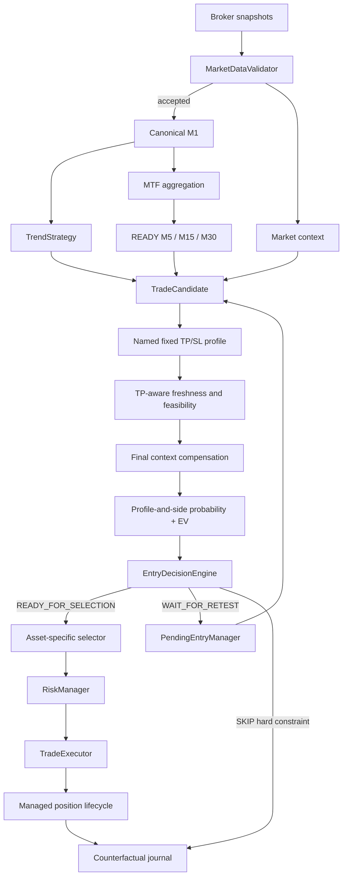

# Goblin!

> A deterministic intraday trading bot that lives in a cave, watches markets all day, and refuses to confuse activity with opportunity.

**Goblin!** is an experimental and auditable trading engine written in Python. It validates broker data, builds deterministic market structure, detects directional setups, estimates trading costs, scores the probability of reaching a fixed target, then applies explicit risk controls before an order can reach the broker.

> [!WARNING]
> Goblin is research software, not financial advice. Use `paper` or `etoro_demo` while the strategy is being calibrated. Real-money trading can lose capital.

## Core principles

- **Deterministic execution** — the same accepted data and versioned configuration must produce the same decision.
- **Demo first** — an edge is never assumed from a handful of trades.
- **Validated data only** — rejected or quarantined snapshots cannot create candles or entries.
- **TP-aware evidence** — the score and probability describe whether the effective TP can be reached before the effective SL.
- **Costs are part of the trade** — fees and spread are evaluated before selection and in net expectancy.
- **No probabilistic vetoes** — context, MTF and timing modify evidence but cannot reject a trade alone.
- **Hard constraints remain explicit** — invalid data, impossible economics, incompatible session horizon, invalid structure and risk limits may reject.
- **Every decision leaves evidence** — raw data, bars, candidates, contributions, routes, summaries and manifests are retained.
- **Doing nothing is valid** — zero trades can still be the correct outcome.

## Current capabilities

Goblin currently includes:

- one active, code-versioned `BalancedStrategyConfig`;
- local paper, eToro demo and eToro live broker adapters;
- crypto, US-equity and European-equity support;
- timezone-aware trading sessions and force-close windows;
- stateful market-data validation with jump quarantine;
- canonical fixed M1 candles and deterministic M5/M15/M30/H1 bars;
- explicit timeframe maturity: `UNAVAILABLE`, `PROVISIONAL`, `READY`;
- context-only benchmark instruments: `Crypto10`, `SPX500`, `FRA40`;
- benchmark, breadth, sector and compressed relative-strength scoring;
- deterministic BUY and SELL trend/breakout signals;
- three-factor TP feasibility with diagnostic entry freshness;
- profile-and-side-calibrated TP-before-SL probability and net expectancy;
- structural retest pending entries with deterministic lineage;
- fixed named SL/TP profiles and structural pending stops;
- net breakeven and trailing-stop management;
- cooldown, account and session risk limits;
- SQLite position and cooldown persistence;
- JSONL journals, schema-v8 summaries and versioned run manifests;
- a broad pytest suite validated by GitHub Actions.

## Decision pipeline



## Canonical candidate score

```text
final score
= directional setup score
+ compressed market-context contribution [-4, +4]
+ READY M5 contribution [-3, +3]
+ TP-feasibility contribution
```

Every contribution is journalled independently. There are no hidden score caps.

### TP-aware entry freshness

Goblin measures how much directional session movement has already occurred relative to the target still requested:

```text
movement_consumed_to_tp_ratio
= directional session move / effective TP
```

The ratio becomes a continuous `entry_freshness_score` from 0 to 100. It is retained for diagnosis and counterfactual analysis, but has no live score or probability weight.

### Market context

The context model first calculates the market background from:

- benchmark session return;
- benchmark rolling momentum;
- same-market breadth;
- sector participation.

Directional relative strength then compensates that background. Its adjustment is multiplied by entry freshness:

```text
strong relative strength + fresh entry
→ meaningful compensation

strong relative strength + consumed move
→ limited compensation
```

A contrary benchmark is never a veto. The raw context remains bounded to `[-15, +15]`; its live contribution is `clip(raw × 0.25, -4, +4)`.

### Multi-timeframe contribution

Only `READY` observations contribute:

| Timeframe | Aligned | Opposed |
|---|---:|---:|
| M5 | +3 | -3 |
| M15 | 0 | 0 |
| M30 | 0 | 0 |
| H1 | 0 | 0 |
| `PROVISIONAL` | 0 | 0 |

Only M5 affects the live score, bounded to `[-3, +3]`. M15, M30 and H1 remain fully journalled diagnostics.

### TP feasibility

`tp_feasibility_score_v4` combines:

| Component | Weight |
|---|---:|
| TP versus ATR | 35% |
| TP versus recent momentum | 30% |
| Estimated costs versus TP | 35% |
| TP-aware entry freshness | 0% — diagnostic only |

It contributes between `-15` and `+15`. The only feasibility hard reject is:

```text
estimated total costs >= gross TP distance
```

## Probability and ranking

`heuristic_v5` uses direct components once each:

- cost/TP;
- TP/ATR;
- TP/momentum;
- trend and close quality;
- regime;
- final context;
- READY M5.

Calibration is keyed by the named profile and side, for example:

```text
us_intraday_fixed_v1:BUY
us_intraday_fixed_v1:SELL
eu_trend_buy_v1:BUY
eu_intraday_fixed_v1:SELL
```

The model exposes raw probability, calibrated probability, break-even probability, probability edge and net expected value. EV remains diagnostic and is not a veto. Live ranking uses exact score, then TP feasibility, then directional score.

## Fixed V1 profiles

| Profile | Side | TP | SL | Stale horizon |
|---|---|---:|---:|---:|
| `us_intraday_fixed_v1` | BUY/SELL | 1.20% | 0.70% | 60 min |
| `eu_trend_buy_v1` | BUY | 2.00% | 1.20% | 180 min |
| `eu_intraday_fixed_v1` | SELL/base | 1.00% | 0.70% | 75 min |
| `crypto_intraday_fixed_v1` | BUY/SELL | 3.00% | 1.50% | 60 min |

The former US ATR-based TP/SL mode and missing-ATR fallback do not exist. A future attainable-target V2 is deliberately deferred until the fixed profiles and probability model are calibrated.

A confirmed pending setup may use a structural SL while retaining the named baseline target and probability calibration profile.

## Selection

| Asset class | Minimum score | Top N per loop |
|---|---:|---:|
| Crypto | 115 | 2 |
| US equity | 115 | 2 |
| EU equity | 110 | 1 |

Selection limits are independent by asset class. There is no dynamic US threshold.

## Session horizon

Finite-session entries must have enough time remaining for:

```text
profile stale horizon + force-close buffer
```

This hard constraint applies to both new signals and pending confirmations. It prevents, for example, opening a 180-minute European profile shortly before the mandatory close.

## Managed stops

Breakeven protection is net of estimated costs:

```text
locked gross move = estimated total costs + configured net buffer
```

Trailing protection remains cost-aware and activates only when its candidate stop locks the configured minimum net gain. Every stop change emits `managed_stop_updated` and is persisted before the next snapshot.

## Market-data and timeframe invariants

- M1 is the only snapshot-built timeframe.
- Higher bars derive only from complete closed M1 bars.
- Missing prices are never fabricated.
- Candidate features obey no-lookahead boundaries.
- Live timestamp validation uses actual receipt/validation time.
- Historical replay keeps its supplied deterministic clock.

## Running

Python 3.12 or newer is required.

```bash
cp .env.example .env
bash scripts/start_goblin.sh
```

The launcher runs Docker Compose in the foreground so an intentional stop can finalize the summary and manifest.

Local execution:

```bash
python -m venv .venv
source .venv/bin/activate
pip install -r requirements.txt
python -m app.main
```

## Analysis contract

PR5-D uses summary and run-manifest schema **v9**. Standalone `entry_decision` records include:

- deterministic candidate/pending lineage;
- named profile and effective SL/TP;
- directional, context, MTF and feasibility scores;
- `movement_consumed_to_tp_ratio` and `entry_freshness_score`;
- raw and calibrated probability plus calibration profile;
- break-even, EV and probability edge;
- route and selection outcome.

The summary also exposes profile horizon rejections, managed-stop updates and corrected risk-stage counts.

## Pre-live status

Goblin remains **demo-only**. Before real capital, the project still requires:

- real broker exit fills;
- broker-side catastrophe protection for BUY positions;
- broker-to-local position reconciliation;
- daily-loss, drawdown and kill-switch controls;
- watchdogs and failure alerts;
- controlled price precision and rounding.

The current objective is repeatable calibration, not a claim of profitability.
