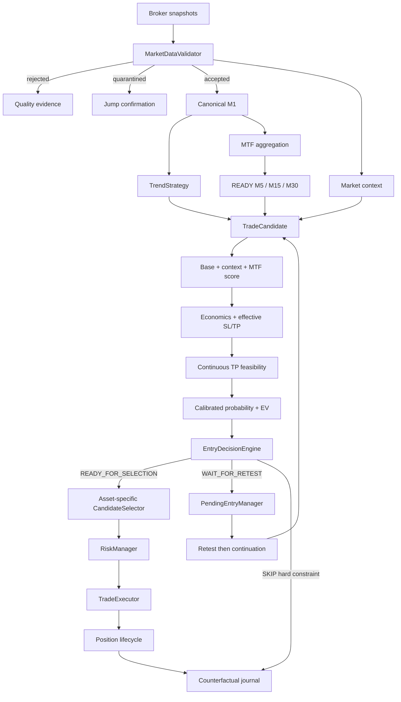

# Goblin!

> A deterministic intraday trading bot that lives in a cave, watches markets all day, and refuses to confuse activity with opportunity.

**Goblin!** is an experimental and auditable trading engine written in Python. It validates broker data, builds deterministic market structure, detects directional setups, estimates trading costs, scores context and timing, then applies risk controls before an order can reach the broker.

> [!WARNING]
> Goblin is research software, not financial advice. Use `paper` or `etoro_demo` while the strategy is being calibrated. Real-money trading can lose capital.

## Core principles

- **Deterministic execution** — the same accepted data and versioned configuration must produce the same decision.
- **Demo first** — an edge is never assumed from a handful of trades.
- **Validated data only** — rejected or quarantined snapshots cannot create candles or entries.
- **Costs are part of the trade** — fees and spread are evaluated before selection.
- **No probabilistic vetoes** — context, MTF and TP feasibility modify the score but cannot reject a trade alone.
- **Hard constraints remain explicit** — invalid data, impossible economics, invalid structure and risk limits may reject.
- **Every decision leaves evidence** — raw data, bars, candidates, contributions, routes, summaries and manifests are retained.
- **Doing nothing is valid** — zero trades can still be the correct outcome.

## Current capabilities

Goblin currently includes:

- one active, code-versioned `BalancedStrategyConfig`;
- local paper, eToro demo and eToro live broker adapters;
- crypto, US-equity and European-equity universes;
- timezone-aware trading sessions and force-close windows;
- stateful market-data validation with jump quarantine;
- a canonical fixed M1 candle stream;
- deterministic M5, M15, M30 and H1 aggregation from closed M1 bars;
- explicit timeframe maturity: `UNAVAILABLE`, `PROVISIONAL`, `READY`;
- context-only benchmark instruments: `Crypto10`, `SPX500`, `FRA40`;
- benchmark, breadth, sector and directional relative-strength scoring;
- deterministic BUY and SELL trend/breakout signals;
- continuous TP-feasibility scoring;
- asset-calibrated TP-before-SL probability and net expectancy;
- structural retest pending entries with deterministic lineage;
- cooldown, account and session risk limits;
- fixed, dynamic and structural SL/TP profiles;
- a dedicated longer-horizon European BUY profile;
- SQLite position and cooldown persistence;
- JSONL journals, final summaries and versioned run manifests;
- a broad pytest suite validated by GitHub Actions.

## Decision pipeline



## Canonical candidate score

The live score has one explicit composition:

```text
final score
= directional setup score
+ market context contribution
+ READY multi-timeframe contribution
+ TP-feasibility contribution
```

The contributions are journalled independently. There are no hidden score caps.

### Market context contribution

The context score combines:

- benchmark session return;
- benchmark rolling momentum;
- same-market breadth;
- sector participation;
- directional relative strength of the symbol versus its benchmark.

Directional relative strength is the dominant component. A BUY can therefore compensate a falling benchmark when the symbol materially outperforms it. A SELL uses the same calculation with the direction inverted.

The context score is bounded to `[-20, +20]` and **never produces a veto**. The descriptive labels `aligned`, `neutral`, `opposed` and `unknown` remain available only for analysis.

### Multi-timeframe contribution

Only mature features affect the live score:

| Timeframe | Aligned | Opposed |
|---|---:|---:|
| M5 `READY` | +4 | -4 |
| M15 `READY` | +6 | -6 |
| M30 `READY` | +2 | -2 |
| H1 | 0 | 0 |
| Any `PROVISIONAL` timeframe | 0 | 0 |

The total MTF contribution is bounded to `[-10, +10]`. H1 and provisional observations remain journalled but do not influence execution.

### Continuous TP feasibility

The old soft/hard/severe penalty accumulation no longer exists. TP feasibility is a `0–100` score made from:

| Component | Weight |
|---|---:|
| TP versus ATR | 30% |
| TP versus recent momentum | 25% |
| Estimated costs versus TP | 30% |
| Remaining session movement | 15% |

It becomes a contribution between `-15` and `+15`.

The only TP-feasibility hard rejection is:

```text
estimated total costs >= gross TP distance
```

## Entry routing and pending entries

`EntryDecisionEngine` has three outcomes:

- `READY_FOR_SELECTION` — timing is acceptable; score, ranking and risk checks still apply;
- `WAIT_FOR_RETEST` — price is structurally extended and a useful retest exists;
- `SKIP` — a real economic or structural hard constraint applies.

Market context is not used by the router.

A pending entry requires a return to the structural level followed by continuation. A confirmed pending candidate carries:

```text
entry_origin = pending_confirmation
structural_confirmation_satisfied = true
```

The same retest can therefore never be requested twice. Temporary spread excess blocks confirmation without invalidating the structural setup.

## Probability and ranking

`heuristic_v3` exposes both:

- the raw explainable TP-before-SL probability;
- an asset-calibrated probability for US equities, European equities and crypto.

It then calculates:

```text
break-even probability after costs
net expected value percent
probability edge
```

EV is **not a veto**. Within the same five-point score bucket, ranking uses:

1. calibrated net expected value;
2. expected net profit at TP;
3. exact candidate score.

## Asset-specific selection

Selection limits are independent by asset class:

| Asset class | Minimum score | Dynamic minimum | Top N per loop |
|---|---:|---:|---:|
| Crypto | 115 | — | 2 |
| US equity | 115 | 100 for dynamic SL/TP | 2 |
| EU equity | 110 | — | 1 |

The EU top-one rule does not reduce the US or crypto top N.

## European strategy

The former EU micro-scalp fallback has been deleted.

### `EU_TREND_BUY_V1`

European BUY candidates use a longer-horizon profile:

| Parameter | Value |
|---|---:|
| Take profit | 2.00% |
| Stop loss | 1.20% |
| Stale horizon | 180 minutes |
| Minimum score | 110 |
| Top N | 1 |

European SELL candidates keep the standard intraday profile:

| Parameter | Value |
|---|---:|
| Take profit | 1.00% |
| Stop loss | 0.70% |
| Stale horizon | 75 minutes |

## Fixed timeframes

Candle duration is a strategy invariant:

| Timeframe | Duration |
|---|---:|
| M1 | 60 seconds |
| M5 | 300 seconds |
| M15 | 900 seconds |
| M30 | 1,800 seconds |
| H1 | 3,600 seconds |

`CANDLE_TIMEFRAME_SECONDS` does not exist. `POLL_INTERVAL_SECONDS` controls broker sampling but never changes candle duration.

Higher timeframes are constructed only from complete contiguous M1 bars. Goblin does not fabricate missing candles.

## Market-data validation

Before a snapshot can update strategy state, Goblin checks:

- finite and positive bid, ask and last;
- inverted quotes;
- abnormal data spreads;
- stale, future or out-of-order timestamps;
- last-price consistency with bid/ask;
- suspicious unconfirmed jumps;
- missing requested snapshots.

Live validation uses the actual receipt/validation time rather than the timestamp captured before the broker request. Historical replay keeps its explicitly supplied clock.

## Base risk profiles

These are baseline values. Directional, dynamic and structural profiles may override them for an individual candidate.

| Asset class | Max position | Baseline SL | Baseline TP | Max spread | Stale age | Percentage costs |
|---|---:|---:|---:|---:|---:|---:|
| Crypto | 0.75% equity | 1.50% | 3.00% | 0.35% | 60 min | 1.00% open + 1.00% close + spread |
| US equity | 0.75% equity | 0.90% | 1.60% | 0.10% | 60 min | 0.15% open + 0.15% close + spread |
| EU SELL/base | 0.75% equity | 0.70% | 1.00% | 0.15% | 75 min | 0.15% open + 0.15% close + spread |
| EU BUY v1 | 0.75% equity | 1.20% | 2.00% | 0.15% | 180 min | 0.15% open + 0.15% close + spread |

Cost values are model inputs and must match the actual account and instruments.

## Configuration

Copy the example file:

```bash
cp .env.example .env
```

Main runtime variables:

| Variable | Default | Description |
|---|---|---|
| `BROKER` | `paper` | `paper`, `etoro_demo` or `etoro_live` |
| `LOG_LEVEL` | `INFO` | Python log level |
| `POLL_INTERVAL_SECONDS` | `60` | Delay between polling loops |
| `RUNTIME_HEARTBEAT_MINUTES` | `5` | Heartbeat interval |
| `WATCHLIST` | empty | Symbols eligible for candidates |
| `CRYPTO_SYMBOLS` | empty | Crypto classification |
| `EQUITY_US_SYMBOLS` | empty | US-equity classification |
| `EQUITY_EU_SYMBOLS` | empty | European-equity classification |
| `MARKET_BENCHMARK_CRYPTO` | `Crypto10` | Context-only crypto benchmark |
| `MARKET_BENCHMARK_EQUITY_US` | `SPX500` | Context-only US benchmark |
| `MARKET_BENCHMARK_EQUITY_EU` | `FRA40` | Context-only EU benchmark |
| `MAX_OPEN_POSITIONS` | `1` | Account position limit |
| `MAX_OPEN_POSITIONS_PER_SYMBOL` | `1` | Per-symbol limit |
| `MAX_TRADES_PER_SESSION` | `3` | Session trade limit |

Every watchlist symbol must belong to exactly one asset class. Benchmarks are context-only and can never create orders.

## Running

Python 3.12 or newer is required.

### Docker

```bash
docker compose up --build -d
docker compose logs -f goblin
docker compose down
```

### Local environment

```bash
python -m venv .venv
source .venv/bin/activate
pip install -r requirements.txt
python -m app.main
```

On Windows PowerShell:

```powershell
.\.venv\Scripts\Activate.ps1
python -m app.main
```

## Tests

```bash
pytest -q
```

GitHub Actions is the authoritative full-suite validation for pull requests.

## Analysis contract

PR5-B uses summary and run-manifest schema **v7**. The manifest records:

- source commit and source fingerprint;
- strategy and resolved asset configurations;
- context, MTF, feasibility, probability and router model versions;
- candidate and pending lineage;
- all canonical score contributions;
- raw and calibrated probability;
- break-even probability, EV and probability edge;
- selection, risk, order and position outcomes.

See [`docs/pr5b-context-mtf-eu-strategy.md`](docs/pr5b-context-mtf-eu-strategy.md) for the detailed PR5-B contract.

## Pre-live status

Goblin remains **demo-only**. Before real capital, the project still requires operational work including:

- real broker exit fills;
- broker-side catastrophe protection for BUY positions;
- broker-to-local position reconciliation;
- persisted dynamic stop state;
- daily-loss, drawdown and kill-switch controls;
- watchdogs and failure alerts.

The current objective is to improve the strategy through repeatable demo runs, not to claim profitability or production readiness.
