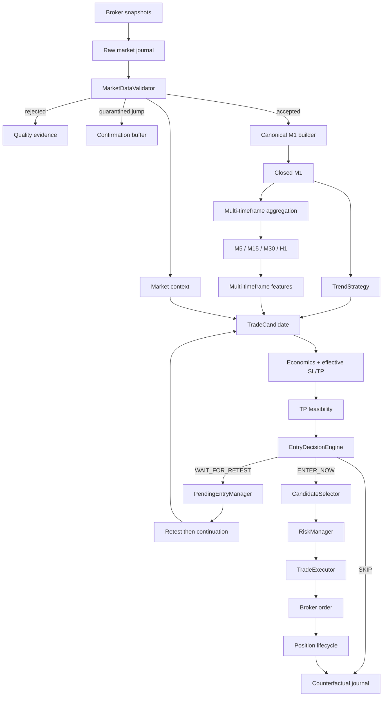

# Goblin!

> A deterministic intraday trading bot that lives in a cave, watches markets all day, and refuses to confuse activity with opportunity.

**Goblin!** is an experimental, auditable trading engine written in Python. It validates broker data, builds deterministic market structure, detects trend-following setups, evaluates fees and risk, and only then permits a candidate to reach execution.

The live decision path contains no language model or opaque AI component. AI may be used later for offline log analysis and research, but the same market state and versioned configuration must produce the same decision.

> [!WARNING]
> Goblin is research software, not financial advice. Use `paper` or `etoro_demo` while the strategy is being validated. Real-money trading can lose capital.

## Core principles

- **Deterministic execution** — decisions must be replayable and testable.
- **Demo first** — profitability is not assumed from a few trades or a backtest fragment.
- **Validated data only** — rejected or quarantined snapshots never reach candles or decisions.
- **Fees are part of the trade** — spread and configured costs are included before selection.
- **Signal quality is not account risk** — strategy, entry routing and risk remain separate responsibilities.
- **No hidden score magic** — categorical decisions and reason codes are preferred to opaque weighting.
- **Every decision leaves evidence** — raw data, bars, contexts, candidates, summaries and manifests are retained.
- **Doing nothing is valid** — zero trades can be the correct outcome.

## Current capabilities

Goblin currently includes:

- one active, code-versioned `BalancedStrategyConfig`;
- local paper, eToro demo and eToro live broker adapters;
- multi-symbol watchlists for crypto, US equities and European equities;
- timezone-aware trading sessions and force-close windows;
- stateful market-data validation with jump quarantine and provenance;
- a canonical fixed M1 candle stream;
- deterministic M5, M15, M30 and H1 aggregation from complete M1 bars;
- explicit gap, incomplete-bar and partial-bar handling without synthetic candles;
- range, opening-range, wick, compression, acceleration and pullback observations;
- active context-only reference indices: `Crypto10`, `SPX500` and `FRA40`;
- benchmark session return, rolling momentum, breadth, sector and relative-strength context;
- deterministic long and short `TrendStrategy` signals on M1;
- separate BUY and SELL scoring paths;
- spread-aware, fee-aware candidate economics;
- structural SL/TP and TP-feasibility analysis;
- explicit `ENTER_NOW`, `WAIT_FOR_RETEST` and `SKIP` routing;
- retest-then-continuation pending entries;
- cooldowns, post-stop symbol locks and post-TP reset guards;
- account-level position and session limits;
- persistent positions and cooldown state in SQLite;
- stop loss, take profit, breakeven, trailing stop, stale exit and session force close;
- immutable candidate identifiers and counterfactual decision records;
- JSONL journals, partial/final summaries and versioned run manifests;
- a broad pytest suite and GitHub Actions validation.

## Decision pipeline



## Fixed timeframes

Candle duration is an invariant of the strategy, not an environment setting:

| Timeframe | Duration |
|---|---:|
| M1 | 60 seconds |
| M5 | 300 seconds |
| M15 | 900 seconds |
| M30 | 1,800 seconds |
| H1 | 3,600 seconds |

`CANDLE_TIMEFRAME_SECONDS` no longer exists. M1 is always the canonical base, and every higher timeframe is aggregated from closed M1 bars.

`POLL_INTERVAL_SECONDS` remains configurable because it controls how often the broker is sampled. It does not redefine a candle. Sparse polling is recorded in the run manifest and produces a startup warning.

See [`docs/multi-timeframe-market-structure.md`](docs/multi-timeframe-market-structure.md) for aggregation, feature and no-lookahead semantics.

## Market-data validation

Before a snapshot can update strategy state, candles, market context or position lifecycle, Goblin checks:

- finite and positive bid, ask and last values;
- inverted quotes;
- abnormal data spreads;
- stale, future or out-of-order timestamps;
- last price consistency with the quote;
- suspicious unconfirmed price jumps;
- missing requested snapshots.

A suspicious jump is quarantined until a later coherent snapshot confirms the new level. Quarantined prices are never retroactively inserted into candles.

## Multi-timeframe structure

Higher-timeframe bars are constructed only from complete contiguous M1 bars:

```text
5 M1  -> M5
15 M1 -> M15
30 M1 -> M30
60 M1 -> H1
```

A missing minute creates a `candle_gap_detected` event. Goblin does not fabricate the missing price. An affected aggregate is marked `incomplete` and excluded from feature calculations.

Finite-session bars are anchored to the actual session opening. For example, a US H1 beginning at 15:30 closes at 16:30 rather than being forced onto a 15:00 UTC-style boundary.

The multi-timeframe layer exposes diagnostic observations including:

- EMA direction and ATR;
- rolling range position and distances;
- previous highs and lows;
- candle body and wick proportions;
- true-range compression;
- recent velocity and acceleration;
- pullback and rebound depth;
- 15-minute and 30-minute opening ranges for finite sessions.

These observations are retained with candidates but do not modify scoring or routing yet. They must earn their place through replay and statistical evidence.

## Market context and reference indices

The trading universe and context universe are separate.

`WATCHLIST` contains symbols allowed to create candidates. The following defaults are context-only instruments:

| Asset class | Reference instrument |
|---|---|
| Crypto | `Crypto10` |
| US equities | `SPX500` |
| European equities | `FRA40` |

Reference instruments are fetched and validated but never receive a strategy instance, never consume a ranking slot and can never reach order execution. They may be overridden or disabled through the corresponding environment settings.

A candidate may carry:

- benchmark direction;
- benchmark return since the active session opened;
- benchmark rolling momentum over the configured window;
- same-market breadth;
- sector context;
- symbol relative strength against the benchmark.

The benchmark direction remains based on the session return. Rolling momentum is a distinct diagnostic value comparing the latest benchmark snapshot with a valid snapshot at or before the configured horizon, currently 180 seconds by default. If the historical reference is missing, belongs to another session or is too old relative to the requested horizon, the momentum is `None`; Goblin does not substitute the session open or interpolate a price.

The combined context classifies the market as `risk_on`, `risk_off`, `mixed` or `unknown`, and the candidate as `aligned`, `neutral`, `opposed` or `unknown`.

`EntryDecisionEngine` is the authority for timing:

- `ENTER_NOW` — the candidate may enter normal ranking and risk checks;
- `WAIT_FOR_RETEST` — a useful structural retest exists and enough runway remains;
- `SKIP` — the current occurrence is abandoned.

A pending entry requires a real return to the structural level followed by continuation. Persistent closes farther away do not count as confirmation. On confirmation the complete candidate is rebuilt with current price, market context, multi-timeframe context, economics and feasibility.

See [`docs/market-context-entry-routing.md`](docs/market-context-entry-routing.md) for benchmark, context and entry-routing semantics.

## Strategy and risk separation

`TrendStrategy` currently consumes the canonical M1 series and recent accepted snapshots. It detects directional trend and breakout/breakdown setups while rejecting dead, ranging or excessively noisy conditions.

A valid signal becomes a `TradeCandidate`. Scoring may describe setup strength, movement already consumed, candle quality and side-specific weaknesses, but a high score does not bypass:

- fee-aware economics;
- TP feasibility;
- entry routing;
- cooldowns;
- account risk limits;
- broker constraints.

`RiskManager` remains responsible for account safety: maximum positions, per-symbol limits, session quotas, spread limits, position sizing and final trade-plan consistency.

## Strategy profile

`BalancedStrategyConfig` is the only active strategy profile. Strategy and risk parameters are code-versioned rather than distributed across many environment variables.

| Profile | Global minimum score | US minimum score | Top candidates per loop |
|---|---:|---:|---:|
| `balanced` | 115 | 100 | 2 |

Each run manifest stores the resolved profile and instrument configurations, including multi-timeframe feature windows.

## Base asset profiles

These are baseline values. Structural stops and dynamic calculations may produce different effective values for an individual candidate.

| Asset class | Max position | Baseline SL | Baseline TP | Max spread | Stale age | Conservative percentage fees |
|---|---:|---:|---:|---:|---:|---:|
| Crypto | 0.75% equity | 1.50% | 3.00% | 0.35% | 60 min | 1.00% open + 1.00% close + spread |
| US equity | 0.75% equity | 0.90% | 1.60% | 0.10% | 60 min | 0.15% open + 0.15% close + spread |
| EU equity | 0.75% equity | 0.70% | 1.00% | 0.15% | 75 min | 0.15% open + 0.15% close + spread |

Fee values are model inputs and must be kept aligned with the account and instruments actually used.

## Configuration

Copy the example file:

```bash
cp .env.example .env
```

### Runtime and broker

| Variable | Default | Description |
|---|---|---|
| `BROKER` | `paper` | `paper`, `etoro_demo` or `etoro_live` |
| `LOG_LEVEL` | `INFO` | Python log level |
| `POLL_INTERVAL_SECONDS` | `60` | Delay between complete market polling loops |
| `RUNTIME_HEARTBEAT_MINUTES` | `5` | Human-readable heartbeat interval |
| `ETORO_API_KEY` | empty | Required for eToro modes |
| `ETORO_USER_KEY` | empty | Required for eToro modes |
| `ETORO_SELLSHORT_SAFETY_SL_BUFFER_PERCENT` | `0.30` | Extra short-position SL safety margin |

### Trading and context universe

| Variable | Default | Description |
|---|---|---|
| `WATCHLIST` | empty | Symbols eligible for candidate creation |
| `CRYPTO_SYMBOLS` | empty | Crypto classification |
| `EQUITY_US_SYMBOLS` | empty | US equity classification |
| `EQUITY_EU_SYMBOLS` | empty | European equity classification |
| `MARKET_BENCHMARK_CRYPTO` | `Crypto10` | Context-only crypto reference |
| `MARKET_BENCHMARK_EQUITY_US` | `SPX500` | Context-only US reference |
| `MARKET_BENCHMARK_EQUITY_EU` | `FRA40` | Context-only EU reference |

Every watchlist symbol must belong to exactly one asset class. Benchmark symbols are validated and used for context but can never create orders. Set a benchmark value to an empty string to disable it explicitly.

### Sessions

| Variable | Description |
|---|---|
| `TRADING_SESSION_TIMEZONE` | IANA timezone for configured windows |
| `TRADING_SESSIONS_CRYPTO` | Comma-separated `HH:MM-HH:MM`; empty means 24/7 |
| `TRADING_SESSIONS_EQUITY_US` | US session windows |
| `TRADING_SESSIONS_EQUITY_EU` | EU session windows |

Example:

```dotenv
WATCHLIST=BTC,ETH,SOL,AAPL,NVDA,AIR.PA
CRYPTO_SYMBOLS=BTC,ETH,SOL
EQUITY_US_SYMBOLS=AAPL,NVDA
EQUITY_EU_SYMBOLS=AIR.PA
MARKET_BENCHMARK_CRYPTO=Crypto10
MARKET_BENCHMARK_EQUITY_US=SPX500
MARKET_BENCHMARK_EQUITY_EU=FRA40
TRADING_SESSION_TIMEZONE=Europe/Paris
TRADING_SESSIONS_CRYPTO=
TRADING_SESSIONS_EQUITY_US=15:30-22:00
TRADING_SESSIONS_EQUITY_EU=09:00-17:30
```

### Global limits

| Variable | Default |
|---|---:|
| `MAX_OPEN_POSITIONS` | `1` |
| `MAX_OPEN_POSITIONS_PER_SYMBOL` | `1` |
| `MAX_TRADES_PER_SESSION` | `3` |

All available runtime and journal variables are documented in [`.env.example`](.env.example).

## Running

Python 3.12 or newer is required.

### Docker

```bash
docker compose up --build -d
docker compose logs -f goblin
docker compose down
```

Runtime data is mounted from `./data` and survives container recreation. The Windows scripts inject the current Git commit into the image so the run manifest identifies the exact source revision.

### Local environment

```bash
python -m venv .venv
source .venv/bin/activate
python -m pip install --upgrade pip
python -m pip install -e ".[dev]"
cp .env.example .env
python -m app.main
```

PowerShell activation:

```powershell
.\.venv\Scripts\Activate.ps1
```

## Structured evidence

Goblin separates application logs from analysis streams:

```text
data/logs/goblin.log
data/logs/trades.jsonl
data/logs/errors.jsonl
data/logs/market.jsonl.gz
data/logs/candles.jsonl.gz
data/logs/debug_decisions.jsonl.gz
data/logs/daily_summary.partial.json
data/logs/daily_summary.json
data/logs/run_manifest.json
```

Each run archives its manifest and summary under:

```text
data/logs/runs/<run_id>/run_manifest.json
data/logs/runs/<run_id>/daily_summary.json
```

The manifest records:

- Git commit and source fingerprint when available;
- Python version;
- sanitized runtime settings;
- resolved strategy and instrument profiles;
- configured context-only benchmarks;
- fixed timeframe invariants;
- polling and expected sampling quality;
- analysis model versions, including `market_context_v2`;
- output paths and retention guarantees.

Every evaluated selected or rejected candidate receives a deterministic identifier and an `entry_decision` record containing market context, multi-timeframe context, economics, effective SL/TP, feasibility, entry action and selection outcome.

This is the evidence base for future MFE, MAE, TP-before-SL, timeout and net-expectancy labels. Those calibrated labels are not claimed to exist yet.

## Project structure

```text
goblin/
├── app/
│   ├── main.py
│   ├── brokers/
│   ├── config/
│   ├── market/
│   │   ├── candle_builder.py
│   │   ├── data_quality.py
│   │   ├── market_context.py
│   │   ├── multi_timeframe.py
│   │   ├── session_timeframe_service.py
│   │   ├── timeframes.py
│   │   └── models.py
│   ├── strategies/
│   ├── instruments/
│   ├── execution/
│   ├── risk/
│   ├── runtime/
│   ├── persistence/
│   └── journal/
├── docs/
├── tests/
├── scripts/
├── Dockerfile
├── docker-compose.yml
└── .env.example
```

## Tests and quality

```bash
python -m pytest tests -v
python -m ruff check app tests
```

GitHub Actions runs validation on pull requests. Tests cover benchmark configuration, rolling momentum, session isolation, exact OHLC aggregation, session anchoring, gaps, incomplete bars, opening ranges, full-session retention and no-lookahead replay.

## Development status

Goblin is under active development. The current goal is not to pile on indicators; it is to collect reliable evidence, reduce late or structurally weak entries, and determine which observations improve net expectancy after costs.

A feature entering the journal is not automatically a feature entering the strategy. That distinction is the whole point.
