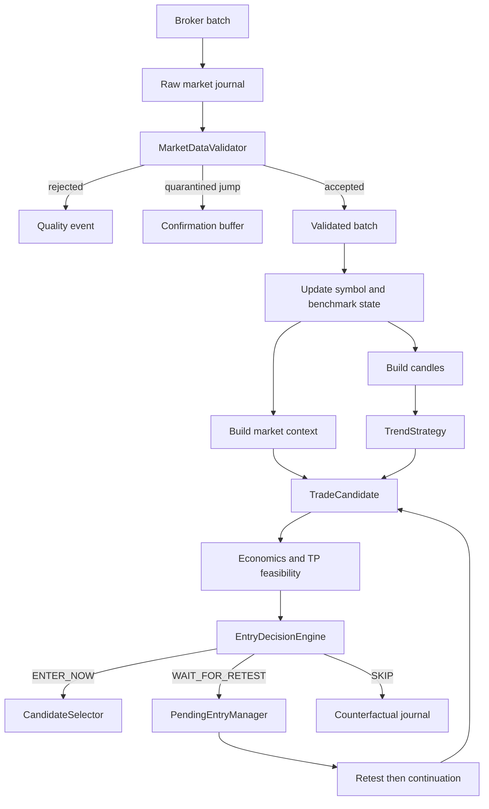

# Validated market context and entry routing

This document describes the Goblin vNext foundation introduced by PR2 and the benchmark activation completed by its corrective follow-up.

## Decision pipeline



## Data-quality gate

Only accepted snapshots may:

- update strategy snapshot history;
- construct or close candles;
- update market context;
- trigger local position lifecycle handling;
- produce a candidate or order.

The validator rejects non-finite or non-positive prices, inverted quotes, abnormal data spreads, stale or future timestamps, out-of-order data and last prices too far from the current quote.

A suspicious price jump is quarantined instead of being trusted immediately. A following snapshot near the new level confirms the jump. Quarantined values are never inserted retroactively into a candle.

`MarketSnapshot` records whether its price came from a broker-provided last value or a bid/ask midpoint fallback.

## Trading universe and context universe

`WATCHLIST` remains the trading universe. Only these symbols may create candidates.

The benchmark settings form a separate context-only universe:

- `MARKET_BENCHMARK_CRYPTO=Crypto10`;
- `MARKET_BENCHMARK_EQUITY_US=SPX500`;
- `MARKET_BENCHMARK_EQUITY_EU=FRA40`.

The configured aliases are normalized internally for broker lookup. Context-only symbols are fetched and validated, but they never receive a strategy instance and can never create a candidate, consume a ranking slot or reach execution.

A benchmark may still be disabled explicitly by setting its environment value to an empty string.

## Market context V2

Every candidate can carry an immutable `CandidateMarketContext` containing:

- asset class;
- benchmark direction and session return;
- benchmark rolling momentum;
- same-market breadth and coverage;
- sector breadth when enough mapped symbols are available;
- symbol session return;
- symbol relative strength against the benchmark;
- market regime: `risk_on`, `risk_off`, `mixed`, or `unknown`;
- candidate alignment: `aligned`, `neutral`, `opposed`, or `unknown`.

The context is deliberately categorical and diagnostic. It is not another opaque score.

All accepted snapshots in a polling loop update the context service before the first candidate decision, preventing watchlist ordering from changing breadth results.

### Benchmark session return

`session_return_percent` compares the latest validated benchmark price with its first validated price in the active session. This value continues to drive the benchmark direction and therefore contributes to `risk_on`, `risk_off`, `mixed` or `unknown` classification.

### Benchmark rolling momentum

`momentum_percent` is distinct from the session return. It compares the latest validated benchmark price with the latest validated snapshot available at or before:

```text
latest benchmark timestamp - momentum_window_seconds
```

The default window is 180 seconds. The reference snapshot must:

- belong to the same active session;
- be at or before the requested horizon;
- be no farther behind that horizon than `maximum_context_age_seconds`.

If no valid reference exists, momentum is `None`. Goblin never substitutes the session opening or fabricates an interpolated price.

Historical snapshots are bounded to 24 hours and finite-session history is removed when that session is reset. This prevents a new equity session from inheriting momentum from the previous trading day.

## Explicit entry actions

`EntryDecisionEngine` is the authority for entry timing:

### `ENTER_NOW`

The setup may reach normal score ranking and account risk checks immediately. It is not a promise that an order will be submitted.

### `WAIT_FOR_RETEST`

The setup remains structurally and economically interesting, but the current price is moderately extended. A valid reference level and sufficient remaining runway are required.

A severe feasibility penalty without a useful retest becomes `SKIP`, not a pending entry.

### `SKIP`

The current setup occurrence is abandoned. Typical reasons include:

- invalid economics after costs;
- strict late-entry, SELL, or TP-feasibility rejection;
- opposed market context;
- severe price extension;
- required context being unavailable.

`CandidateReadiness` remains temporarily as a compatibility diagnostic produced by the existing TP-feasibility component. It no longer decides whether Goblin waits.

## Pending retest lifecycle

A pending entry is created only from `WAIT_FOR_RETEST`.

Confirmation requires:

1. an actual return to the breakout or breakdown area;
2. no structural invalidation;
3. a continuation candle;
4. aligned short-term momentum;
5. a non-opposed current market context.

Persistent closes farther away from the level no longer confirm the pending entry. After confirmation, Goblin rebuilds the candidate with the current price, context and calibrated entry rules. The rebuilt candidate must pass economics, feasibility and `EntryDecisionEngine` again.

Pending lifetime comes from the market-specific `EntryDecisionConfig.maximum_retest_candles` value.

## Counterfactual instrumentation

Every evaluated candidate receives a deterministic `candidate_id` derived from:

- run id;
- symbol and side;
- session key;
- candle close timestamp;
- breakout or breakdown level.

The trade journal writes one standalone `entry_decision` event for selected and rejected evaluated candidates. It contains:

- candidate and id;
- market context;
- economics;
- effective SL/TP;
- TP feasibility and heuristic probability metadata;
- entry action and reason;
- selector outcome;
- strategy and model versions.

This is the schema foundation for future MFE, MAE, TP-before-SL, timeout and net-expectancy labels. The current system does not claim that those labels or a calibrated probability model already exist.

## Run traceability

Run manifests record:

- `market_context_v2`;
- `multi_timeframe_features_v1`;
- `entry_router_v1`;
- the active Balanced profile and resolved instrument configurations;
- the three configured reference indices;
- the source fingerprint and Git commit when available.

The market-context version was incremented because `momentum_percent` changed from a duplicate session-return value to a real rolling-window measurement. Historical runs using `market_context_v1` therefore remain distinguishable from V2 runs.
