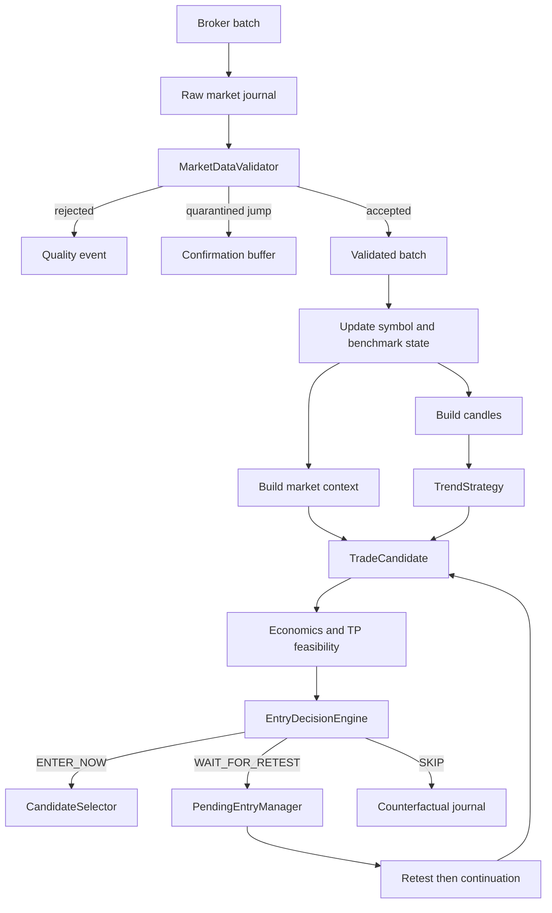

# Validated market context and entry routing

This document describes the Goblin vNext foundation introduced by PR2.

## Decision pipeline

## Data-quality gate

Only accepted snapshots may:

- update strategy snapshot history;
- construct or close candles;
- update market context;
- trigger local position lifecycle handling;
- produce a candidate or order.

The validator rejects non-finite or non-positive prices, inverted quotes, abnormal data spreads, stale or future timestamps, out-of-order data and last prices too far from the current quote.

A suspicious price jump is quarantined instead of being trusted immediately. A following snapshot near the new level confirms the jump. Quarantined values are never inserted retroactively into a candle.

`MarketSnapshot` records whether its price came from a broker-provided last value or a bid/ask midpoint fallback.

## Trading universe and context universe

`WATCHLIST` remains the trading universe. Only these symbols may create candidates.

The optional benchmark settings form a context-only universe:

- `MARKET_BENCHMARK_CRYPTO`
- `MARKET_BENCHMARK_EQUITY_US`
- `MARKET_BENCHMARK_EQUITY_EU`

Context-only symbols are fetched and validated but never receive a strategy instance and can never reach execution. Their exact eToro aliases must be verified before configuration, so the defaults remain empty.

## Market context V1

Every candidate can carry an immutable `CandidateMarketContext` containing:

- asset class;
- benchmark direction and return when configured;
- same-market breadth and coverage;
- sector breadth when enough mapped symbols are available;
- symbol session return;
- symbol relative strength against the benchmark;
- market regime: `risk_on`, `risk_off`, `mixed`, or `unknown`;
- candidate alignment: `aligned`, `neutral`, `opposed`, or `unknown`.

The context is deliberately categorical and diagnostic. It is not another opaque score.

All accepted snapshots in a polling loop update the context service before the first candidate decision, preventing watchlist ordering from changing breadth results.

## Explicit entry actions

`EntryDecisionEngine` is the authority for entry timing:

### `ENTER_NOW`

The setup may reach normal score ranking and account risk checks immediately. It is not a promise that an order will be submitted.

### `WAIT_FOR_RETEST`

The setup remains structurally and economically interesting, but the current price is moderately extended. A valid reference level and sufficient remaining runway are required.

A severe feasibility penalty without a useful retest becomes `SKIP`, not a pending entry.

### `SKIP`

The current setup occurrence is abandoned. Typical reasons include:

- invalid economics after costs;
- strict late-entry, SELL, or TP-feasibility rejection;
- opposed market context;
- severe price extension;
- required context being unavailable.

`CandidateReadiness` remains temporarily as a compatibility diagnostic produced by the existing TP-feasibility component. It no longer decides whether Goblin waits.

## Pending retest lifecycle

A pending entry is created only from `WAIT_FOR_RETEST`.

Confirmation requires:

1. an actual return to the breakout or breakdown area;
2. no structural invalidation;
3. a continuation candle;
4. aligned short-term momentum;
5. a non-opposed current market context.

Persistent closes farther away from the level no longer confirm the pending entry. After confirmation, Goblin rebuilds the candidate with the current price, context and calibrated entry rules. The rebuilt candidate must pass economics, feasibility and `EntryDecisionEngine` again.

Pending lifetime comes from the market-specific `EntryDecisionConfig.maximum_retest_candles` value.

## Counterfactual instrumentation

Every evaluated candidate receives a deterministic `candidate_id` derived from:

- run id;
- symbol and side;
- session key;
- candle close timestamp;
- breakout or breakdown level.

The trade journal writes one standalone `entry_decision` event for selected and rejected evaluated candidates. It contains:

- candidate and id;
- market context;
- economics;
- effective SL/TP;
- TP feasibility and heuristic probability metadata;
- entry action and reason;
- selector outcome;
- strategy and model versions.

This is the schema foundation for future MFE, MAE, TP-before-SL, timeout and net-expectancy labels. PR2 does not claim that those labels or a calibrated probability model already exist.

## Run traceability

Run manifests record:

- `market_context_v1`;
- `entry_router_v1`;
- the active Balanced profile and resolved instrument configurations;
- optional benchmark symbols;
- the source fingerprint and Git commit when available.

The Windows startup script passes `git rev-parse HEAD` into the Docker build so the runtime manifest can identify the exact source commit.
