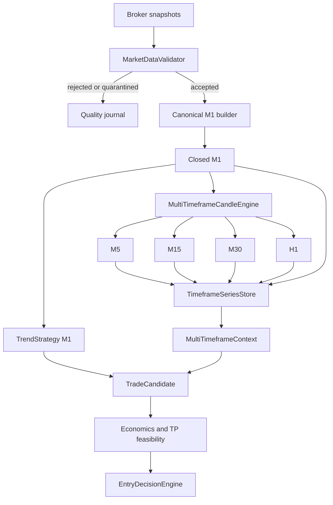

# Multi-timeframe market structure

This document describes the deterministic multi-timeframe foundation introduced by PR3.

## Included user stories

- **US-04 — M1, M5, M15, M30 and H1 candles:** complete implementation.
- **US-05 — range position, observable levels and opening range:** feature implementation.
- **US-06 — acceleration, pullbacks, compression and wicks:** feature implementation.
- **US-02 — counterfactual dataset:** every evaluated candidate can retain its immutable multi-timeframe snapshot.
- **US-16 — statistical release foundations:** versioning, deterministic replay and explicit no-lookahead tests.

PR3 does not assign new score points, penalties or hard rejections from these features. It builds the measurement layer needed to calibrate them later.

## Fixed timeframe invariant

Candle duration is no longer an environment setting. `CANDLE_TIMEFRAME_SECONDS` has been removed from `Settings`, `.env.example` and the run manifest settings snapshot.

The supported timeframes are versioned constants:

```text
M1  = 60 seconds
M5  = 300 seconds
M15 = 900 seconds
M30 = 1800 seconds
H1  = 3600 seconds
```

M1 is the canonical base timeframe. `POLL_INTERVAL_SECONDS` remains configurable because it controls broker sampling frequency, not candle semantics.

## Data pipeline



The PR2 quality invariant remains unchanged: only accepted snapshots may reach candles, strategy state, position lifecycle, market context or candidate construction.

## Canonical M1 and aggregation

Higher-timeframe bars are built only from closed M1 bars:

```text
5 complete M1  -> M5
15 complete M1 -> M15
30 complete M1 -> M30
60 complete M1 -> H1
```

Each `TimeframeBar` records:

- the OHLC candle;
- timeframe and session key;
- completeness status;
- actual and expected source-bar counts;
- missing source-bar count.

Statuses are:

- `complete`: every expected contiguous M1 is present;
- `incomplete`: the bucket closed with missing or non-contiguous M1 bars;
- `partial`: the session or runtime ended before the bucket closed.

Incomplete and partial bars are journaled, but never enter feature calculations.

## Gaps and sampling

The canonical builder closes a candle at its own exact bucket boundary. If the last snapshot of a M1 arrived at 10:00 and the next snapshot arrived at 10:05, the first candle still closes at 10:01.

Goblin does not synthesize 10:01, 10:02, 10:03 or 10:04 candles. It writes a `candle_gap_detected` event, and affected higher-timeframe buckets become incomplete.

M1 candles retain their snapshot count. Sampling quality is descriptive:

- `dense`: at least four samples per M1 on average;
- `acceptable`: at least two;
- `sparse`: fewer than two.

The run manifest also records the expected sampling quality from `POLL_INTERVAL_SECONDS`. A sparse value produces a startup warning but does not change candle duration.

## Session anchoring

Finite equity sessions are anchored on their actual configured opening time.

For a US session beginning at 15:30 Europe/Paris, the buckets are:

```text
M30: 15:30-16:00, 16:00-16:30, ...
H1:  15:30-16:30, 16:30-17:30, ...
```

Crypto sessions configured as 24/7 use UTC boundaries.

A bar never crosses two session keys. On a session transition, open higher-timeframe buckets are flushed as partial bars. Complete historical bars remain available for diagnostic context, while opening-range calculations use only the current session key.

The runtime store retains up to 1,440 M1 bars so opening-range information remains available throughout a full 24-hour session.

## Timeframe features

For every timeframe with enough complete bars, Goblin computes an immutable `TimeframeFeatures` value containing:

### Trend and volatility

- fast and slow EMA;
- close versus fast EMA;
- fast versus slow EMA;
- ATR percent;
- one-bar and three-bar returns;
- descriptive direction: `up`, `down`, `mixed` or `unknown`.

### Range and observable levels

- rolling high and low;
- rolling range percent;
- position inside the range;
- distance to range high and low;
- previous-bar high and low.

These are observable deterministic levels. PR3 deliberately does not label them as validated support or resistance.

### Candle structure

- body percent of total range;
- upper-wick percent;
- lower-wick percent;
- close position inside the bar.

### Compression and movement

- current true-range versus the median historical true-range;
- recent directional velocity;
- previous velocity;
- acceleration;
- pullback from recent high;
- rebound from recent low.

Feature windows live in each code-versioned `InstrumentConfig.multi_timeframe` configuration. Timeframe durations themselves cannot be overridden by a profile.

## Opening ranges

Finite sessions expose 15-minute and 30-minute opening ranges by default.

Each window records:

- status: `warming_up`, `ready`, `incomplete` or `not_applicable`;
- high and low;
- range percent;
- current position inside the range;
- distance to each boundary;
- breakout above and breakdown below percentages;
- actual and expected M1 source counts.

A missing M1 during the opening window makes that opening range incomplete. Crypto 24/7 sessions are `not_applicable` in this version.

## Candidate context

A BUY or SELL candidate can carry an immutable `MultiTimeframeContext` with:

- model version `multi_timeframe_features_v1`;
- exact `as_of` time;
- feature map by timeframe;
- opening-range snapshot;
- aligned, opposed and unavailable timeframes;
- descriptive overall alignment.

Alignment is diagnostic only in PR3. It does not modify:

- strategy signals;
- candidate score;
- `EntryDecisionEngine` output;
- candidate ranking;
- account risk checks;
- order submission.

This prevents uncalibrated intuition from silently changing the live strategy.

## Pending entries

When a pending retest confirms, Goblin rebuilds the candidate with:

- the current accepted snapshot;
- the current M1 candle;
- current PR2 market context;
- current multi-timeframe context;
- current economics and feasibility inputs.

The original pending event remains in the journal, making it possible to compare the original and confirmed structures later.

## Counterfactual evidence

The standalone `entry_decision` record now includes:

- candidate and deterministic candidate id;
- PR2 market context;
- multi-timeframe context and model version;
- economics and effective SL/TP;
- TP feasibility and heuristic probability;
- entry action;
- selection outcome and reason;
- strategy profile.

This enables later research such as:

- M5/M15 alignment versus net outcome;
- M5 rejection wicks versus failed BUY entries;
- opening-range breakouts versus MFE and MAE;
- M30 range position versus remaining runway;
- compression before successful expansion.

PR3 does not yet create future-outcome labels such as MFE, MAE, TP-before-SL or net expectancy.

## No-lookahead guarantee

A feature can use only bars satisfying:

```text
bar.closed_at <= candidate.candle.closed_at
```

Open bars are never exposed as complete features. Appending future candles cannot alter a context rebuilt with the same historical `as_of` timestamp. Dedicated tests enforce this invariant.

## Journals and summaries

The candle stream may contain:

- `candle_closed`;
- `candle_gap_detected`;
- `timeframe_bar_closed`;
- `timeframe_bar_incomplete`;
- `timeframe_bar_partial`.

The trade analysis stream may contain `multi_timeframe_context_built`, and every selected or rejected evaluated candidate keeps its context in `entry_decision`.

The daily summary reports:

- complete, incomplete and partial bars by timeframe;
- gaps by symbol;
- feature readiness and unavailable timeframes;
- multi-timeframe alignment;
- opening-range statuses.

The run manifest schema is version 3 and records fixed timeframe invariants, feature configurations, polling interval, expected sampling quality and retention guarantees.

## Current limitations

- The broker is not yet queried for historical candles at startup.
- A restarted process must warm its timeframe series again.
- Volume remains unavailable when the broker snapshot stream does not provide it.
- Multi-timeframe observations are not yet statistically calibrated into score or entry routing.
- No profitability claim follows from the presence of these indicators.
